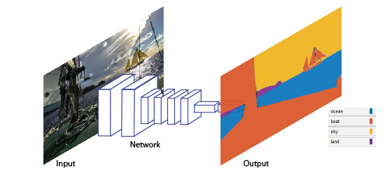
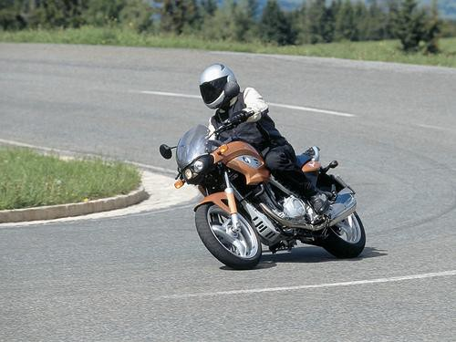
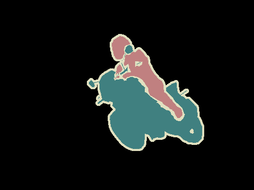
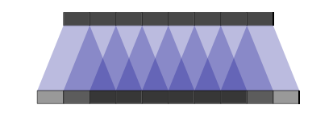

# Semantic Segmentation
### Introduction
Segmentation is essential for image analysis tasks. Semantic segmentation describes the process of associating each pixel of an image with a class label, (such as flower, person, road, sky, ocean, or car).


image source: https://www.mathworks.com/help/vision/ug/semantic-segmentation-basics.html

There are various sectors which find a lot of potential in semantic segmentation approaches. Which obviously include autonomous driving, industrial inspection of boilers, thermals charts etc., classification of terrain visible in satellite imagery, medical imaging analysis. Just for personal interest I also studied about detection of diseases in plants by their leaves. This also includes segmentation to separate the veins or blade from the actual disease markings. This also makes the processing and detection of the disease easier and more accurate.

**But what is semantic segmentation actually ?**

Semantic segmentation is understanding an image at pixel level i.e, we want to assign each pixel in the image an object class. For example, check out the following images.



Input Image, source: http://host.robots.ox.ac.uk/pascal/VOC/voc2012/segexamples/index.html



semantic segmentation. Source: http://host.robots.ox.ac.uk/pascal/VOC/voc2012/segexamples/index.html

In the above image there are only three classes, Human, Bike and everything else. FCN can be trained to detect road, plants and sky as well. VOC2012 and MSCOCO are the most important datasets for semantic segmentation.

In 2014, Fully Convolutional Networks (FCN) by Long et al. from Berkeley, popularized CNN architectures for dense predictions without any fully connected layers. This allowed segmentation maps to be generated for image of any size and was also much faster compared to the patch classification approach which was used earlier. Almost all the subsequent state of the art approaches on semantic segmentation adopted this paradigm.

Apart from fully connected layers, one of the main problems with using CNNs for segmentation is pooling layers. Pooling layers increase the field of view and are able to aggregate the context while discarding the ‘where’ information. However, semantic segmentation requires the exact alignment of class maps and thus, needs the spatial information to be preserved. Two different classes of architectures evolved in the literature to tackle this issue.

First one is encoder-decoder architecture. Encoder gradually reduces the spatial dimension with pooling layers and decoder gradually recovers the object details and spatial dimension. There are usually shortcut connections from encoder to decoder to help decoder recover the object details better.


The second approach is not discussed here.

While going through padding differences in transposed convolution, I learnt something really interesting about SAME and VALID padding. The most important thing to understand here is that the filter kernel doesn’t goes out of the input image dimensions in Valid padding, and this is true for both convolution and transposed convolution. Similarly in Same padding kernel can go out of the image dimension.

Talking more about Valid padding. As you increase the stride of the kernel, Input image is padded between the pixels. If the stride is 2, there will be one row and column padded between each existing row and column. If stride is 1 there won’t be any padding.



Stride:1, kernel:3x3, source: https://distill.pub/2016/deconv-checkerboard/


Stride:2, kernel:3x3, source: https://distill.pub/2016/deconv-checkerboard/

Keeping the k same and increasing stride decreases overlapping.This overlapping refers to the common area calculated by the adjacent kernel actions. Let’s also visualize the opposite effect.


Stride:2, kernel:4x4, source: https://distill.pub/2016/deconv-checkerboard/

Thus the padded input image depends upon the stride as

**Ip_d= (I-1) x s**
where s=stride, I= Input dimension, and Ip_d is padded input dimension.
And the output Image dimension depends upon padded input image dimesion and kernel size as below:

**O_d= Ip_d+ k;
O_d= (I-1) x s+k; where k is kernel size.**
This equation holds true whether kernel size is greater or smaller than the stride and can be verified here. However, one of my colleague has derived a better equation while playing with some code on tensorflow which says.

**O_d = I x s+ max(k — s, 0); where all variables are same as above.
I suggest playing around with the code a bit.** 

Same Padding is simpler but rather mysterious. Same padding always pads the empty rows and columns on the outside of the image. In normal convolution even if padding is same and the kernel can sweep the complete image properly with the mentioned stride, no padding is actually done on the input image. However if some rows or columns are left due to the kernel size and stride value, some extra columns and rows are added to cover the whole image.

This is not the case in transposed convolution. Output image dimension is not dependent on kernel size of the filter but increases by the number of times of mentioned stride.

**O_d= I_d x s;**
where s=stride, I_d= Input dimension, and O_d is padded input dimension.

Output dimension is calculated by the system beforehand in this case and then the image is padded on the outside accordingly before applying the filter to maintain the output dimension, the same as calculated, after the deconvolution. Priority is given to the addition of columns, equally on both sides of the image. However if they can’t be added equally, the remaining extra column is added to the right side.

**So how can I up-sample an image using both of these filter?**

It’s simple as now we have the equations. Suppose we want to upscale an image to two times of the original.

For Same padding you can set the kernel to any suitable value and stride to 2.

For Valid padding you can set both the kernel and stride value to 2.

However the performance of these filters is an area of experimentation. I found Same padding to be working better than the Valid padding here. Setting kernel size to an even number is not a good practice, but if you want to upscale by a factor of 2 using valid padding, there seems to be no other way.

### Setup
##### GPU
`main.py` will check to make sure you are using GPU - if you don't have a GPU on your system, you can use AWS or another cloud computing platform.
##### Frameworks and Packages
Make sure you have the following is installed:
 - [Python 3](https://www.python.org/)
 - [TensorFlow](https://www.tensorflow.org/)
 - [NumPy](http://www.numpy.org/)
 - [SciPy](https://www.scipy.org/)
##### Dataset
Download the [Kitti Road dataset](http://www.cvlibs.net/datasets/kitti/eval_road.php) from [here](http://www.cvlibs.net/download.php?file=data_road.zip).  Extract the dataset in the `data` folder.  This will create the folder `data_road` with all the training a test images.

### Start
##### Implement
Implement the code in the `main.py` module indicated by the "TODO" comments.
The comments indicated with "OPTIONAL" tag are not required to complete.
##### Run
Run the following command to run the project:
```
python main.py
```
**Note** If running this in Jupyter Notebook system messages, such as those regarding test status, may appear in the terminal rather than the notebook.

### Submission
1. Ensure you've passed all the unit tests.
2. Ensure you pass all points on [the rubric](https://review.udacity.com/#!/rubrics/989/view).
3. Submit the following in a zip file.
 - `helper.py`
 - `main.py`
 - `project_tests.py`
 - Newest inference images from `runs` folder  (**all images from the most recent run**)
 
 ### Tips
- The link for the frozen `VGG16` model is hardcoded into `helper.py`.  The model can be found [here](https://s3-us-west-1.amazonaws.com/udacity-selfdrivingcar/vgg.zip)
- The model is not vanilla `VGG16`, but a fully convolutional version, which already contains the 1x1 convolutions to replace the fully connected layers. Please see this [forum post](https://discussions.udacity.com/t/here-is-some-advice-and-clarifications-about-the-semantic-segmentation-project/403100/8?u=subodh.malgonde) for more information.  A summary of additional points, follow. 
- The original FCN-8s was trained in stages. The authors later uploaded a version that was trained all at once to their GitHub repo.  The version in the GitHub repo has one important difference: The outputs of pooling layers 3 and 4 are scaled before they are fed into the 1x1 convolutions.  As a result, some students have found that the model learns much better with the scaling layers included. The model may not converge substantially faster, but may reach a higher IoU and accuracy. 
- When adding l2-regularization, setting a regularizer in the arguments of the `tf.layers` is not enough. Regularization loss terms must be manually added to your loss function. otherwise regularization is not implemented.
 
### Using GitHub and Creating Effective READMEs
If you are unfamiliar with GitHub , Udacity has a brief [GitHub tutorial](http://blog.udacity.com/2015/06/a-beginners-git-github-tutorial.html) to get you started. Udacity also provides a more detailed free [course on git and GitHub](https://www.udacity.com/course/how-to-use-git-and-github--ud775).

To learn about REAMDE files and Markdown, Udacity provides a free [course on READMEs](https://www.udacity.com/courses/ud777), as well. 

GitHub also provides a [tutorial](https://guides.github.com/features/mastering-markdown/) about creating Markdown files.
